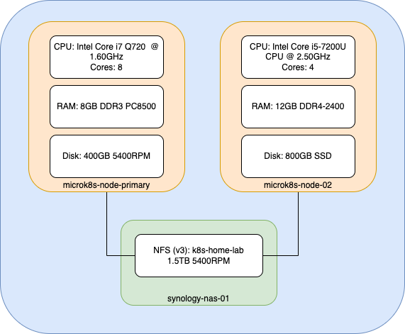
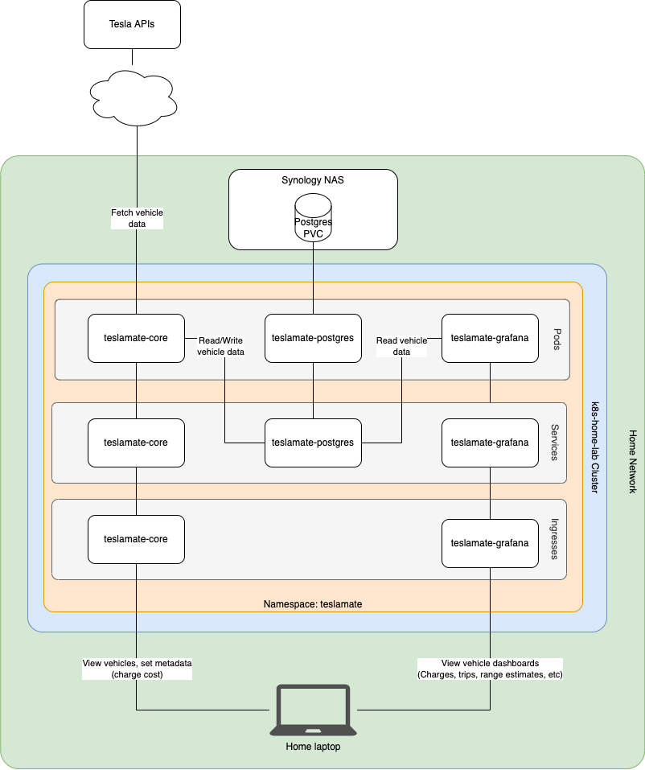

# Overview

I've always wanted to build out a home lab, both for the overall tinker factor but also to have a place to experiment with new solutions outside the friction of Enterprise processes.

Initially, I was thinking about something like a [TuringPi](https://turingpi.com/). Seeing the soaring prices of everything in the microcomputer landscape, my attention turned to a pile of old laptops collecting dust in my closet. Beyond being free, they had the additional benefit of being x86-based and easily upgradable.

With that, I installed Ubuntu on a couple of laptops and set out to build a 2-node [microk8s](https://microk8s.io/) cluster. Having some initial succes, I went about making things a bit more robust. I migrated off of WiFi onto a dedicated switch (which was a [bit of an adventure](https://github.com/canonical/microk8s/issues/1955#issuecomment-1214434568)) and bought a used NAS setup to enable proper PersistentVolumes.

At this point, I knew I wanted to bring [Flux](https://fluxcd.io/) into the mix, as I am a huge proponent of automation and repeatability. After all, if I go much further down the rabbit hole, I am likely to upgrade hardware, etc.

That brings us to this repo: This is how I manage not only underlying cluster-wide services ([NFS-backed PVs](https://github.com/kubernetes-sigs/nfs-subdir-external-provisioner), [SealedSecrets](https://fluxcd.io/docs/guides/sealed-secrets/), etc), but also any apps/services I want to run on top.

# Flux

All of the Flux-related assets are in the [dev cluster directory](./clusters/dev/). Currently, the directory structure is:

```
├── clusters
│   ├── dev
│   │   ├── apps
│   │   │   └── teslamate
│   │   │       ├── postgres-nfs-helmrelease.yaml
│   │   │       ├── source-helmrepo-bitnami.yaml
│   │   │       ├── source-helmrepo-grafana.yaml
│   │   │       ├── source-helmrepo-k8s-at-home.yaml
│   │   │       ├── teslamate-grafana-helmrelease.yaml
│   │   │       ├── teslamate-helmrelease.yaml
│   │   │       └── teslamate-postgres-sealed.yaml
│   │   ├── cluster-services
│   │   │   ├── nfs-external-provisioner-helmrelease.yaml
│   │   │   ├── sealed-secrets-helmrelease.yaml
│   │   │   ├── source-helmrepo-nfs-external-provisioner.yaml
│   │   │   └── source-helmrepo-sealed-secrets.yaml
│   │   └── flux-system
│   │       ├── gotk-components.yaml
│   │       ├── gotk-sync.yaml
│   │       └── kustomization.yaml
│   └── disabled
│       └── mosquitto-helmrelease.yaml
```

Note: The `disabled` directory is a simple way to remove items from Flux's purview without deleting the file itself. This is because `gotk-sync.yaml` tells the Flux components deployed in my cluster to only look at files under `./clusters/dev`:

```spec:
  interval: 10m0s
  path: ./clusters/dev
  prune: true
  sourceRef:
    kind: GitRepository
    name: flux-system
```

## SealedSecrets

A key feature used is [SealedSecrets](https://fluxcd.io/docs/guides/sealed-secrets/), which allows for encrypted secrets to be safely committed to a public repo. Absent this, secrets would have to be managed manually outside of Flux.

Check out the [SealedSecrets doc](./docs/sealed-secrets.md) for details on how it all works.

# Topology

I am starting off pretty basic, so nothing super thrilling about the topology currently, but here is what it looks like.

## Network


Note: There are Calico VLANs managed by MicroK8s that aren't (yet) represented on this diagram.

## Hardware



# Applications

So far, there is only one application deployed: [Teslamate](https://github.com/adriankumpf/teslamate), a service that pulls a myriad of data from Tesla's APIs.

Logically, the deployment looks like this:



# The Future

Like any nerdy endeavor, there's always more left to do, so I catalog those [future improvements here](./TODO.md).