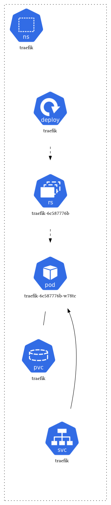
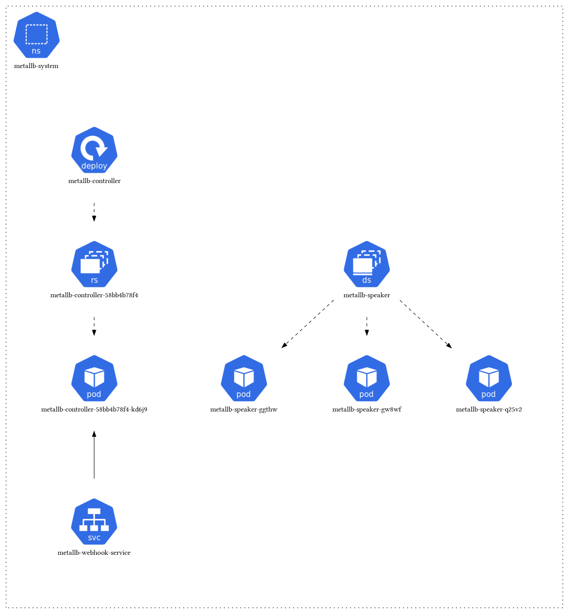
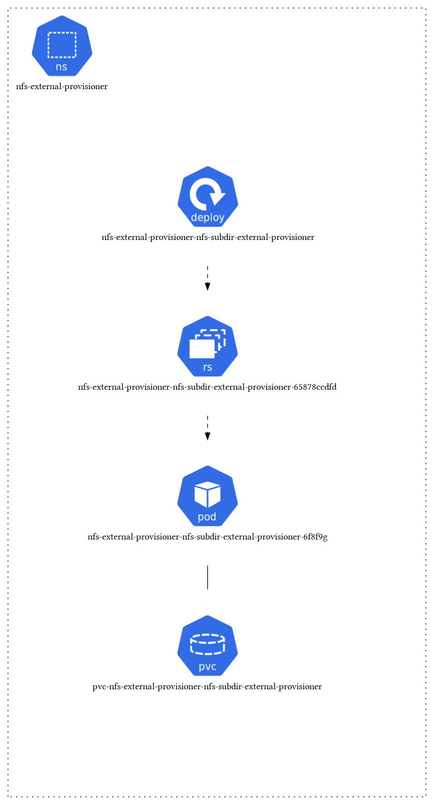
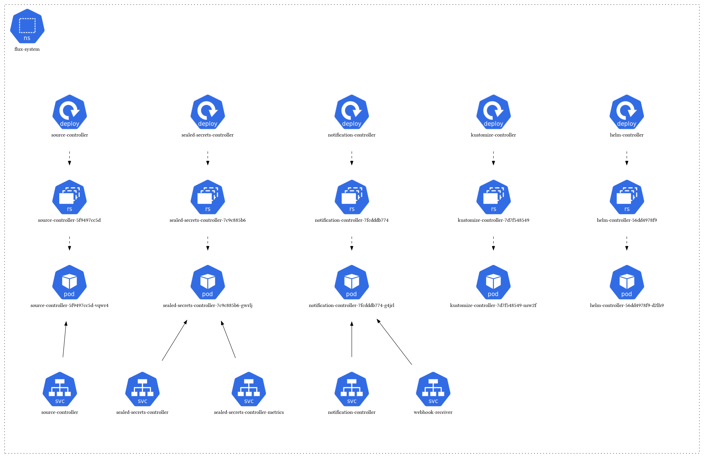

# Core Infrastructure

## Traefik
**Purpose**: Ingress controller and reverse proxy

Traefik serves as the main ingress controller for the cluster, handling external traffic routing to internal services. It provides SSL termination, load balancing, and routing based on hostnames and paths.

## MetalLB
**Purpose**: Load balancer for bare metal Kubernetes clusters

MetalLB provides load balancing services for bare metal Kubernetes clusters where cloud provider load balancers are not available. It assigns external IP addresses to services that need to be accessible from outside the cluster.

## NFS External Provisioner
**Purpose**: Dynamic storage provisioning using NFS

The NFS External Provisioner enables dynamic provisioning of PersistentVolumes using NFS storage. This allows applications to request storage dynamically without manual intervention.

## Sealed Secrets
**Purpose**: Encrypted secrets management for GitOps

Sealed Secrets allows encrypted secrets to be safely committed to a public repository. The Sealed Secrets controller decrypts them into regular Kubernetes secrets when deployed to the cluster.

 