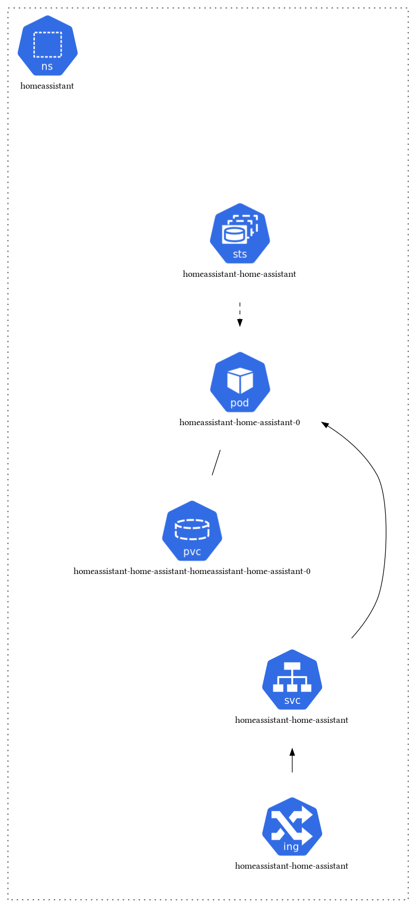
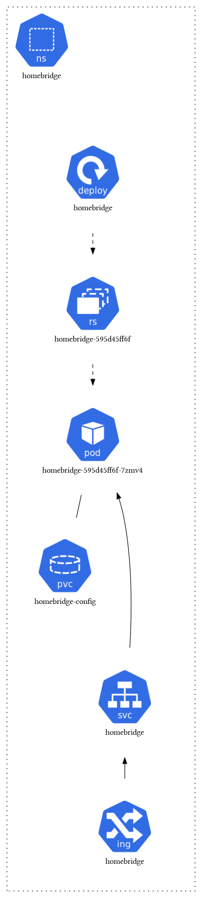

# Home Automation

## Home Assistant
**Purpose**: Open source home automation platform

Home Assistant is a powerful open-source home automation platform that puts local control and privacy first. It integrates with a wide variety of smart home devices and services, allowing you to create complex automation scenarios.

**Features**:
- Local control and privacy
- Extensive device integration
- Powerful automation engine
- Web-based interface
- Mobile app support

## Homebridge
**Purpose**: HomeKit bridge for non-HomeKit devices

Homebridge allows you to integrate non-HomeKit devices with Apple's Home app and Siri. It acts as a bridge between HomeKit and various smart home protocols and devices.

**Features**:
- HomeKit compatibility
- Plugin ecosystem
- Support for various protocols (Zigbee, Z-Wave, etc.)
- Local processing

 