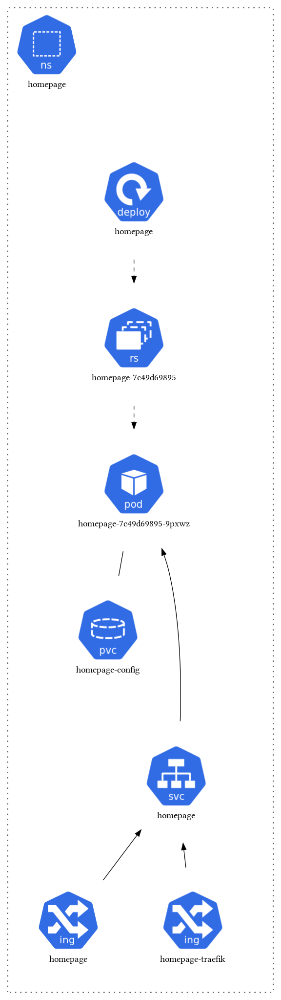

# Homepage

**Purpose**: Dashboard for accessing all services

Homepage is a clean, simple, and fast dashboard for accessing all your services. It provides a centralized landing page with quick access to all applications running in your home lab.

## Features

- **Service discovery**: Automatically discovers services from Kubernetes
- **Customizable layout**: Drag-and-drop interface for organizing services
- **Service grouping**: Organize services into logical groups
- **Status monitoring**: Real-time status of services
- **Custom icons**: Support for custom icons and branding
- **Mobile responsive**: Works perfectly on mobile devices
- **Dark/Light themes**: Multiple theme options

## Architecture

Homepage integrates with Kubernetes for service discovery and provides a clean web interface:

## Configuration

Homepage uses a ConfigMap for configuration and integrates with Traefik for ingress. It can automatically discover services and their status through Kubernetes API integration.

## Components

- **Homepage**: Main dashboard application
- **ConfigMap**: Configuration for services and layout
- **PersistentVolume**: Storage for user preferences and customizations
- **Traefik Ingress**: External access and SSL termination 