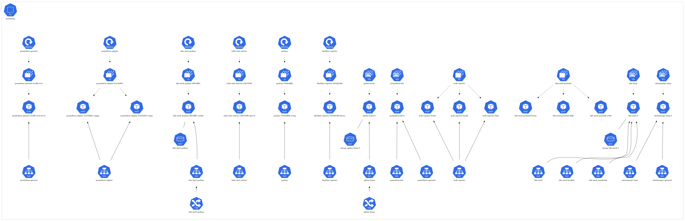

# Monitoring & Observability

## Loki Stack
**Purpose**: Log aggregation and visualization (Grafana + Loki)

The Loki Stack provides comprehensive logging and visualization capabilities for the cluster. It includes Grafana for dashboards and Loki for log aggregation, allowing you to monitor and troubleshoot applications effectively.

**Components**:
- **Grafana**: Dashboard and visualization platform
- **Loki**: Log aggregation system
- **Promtail**: Log collection agent

**Features**:
- Centralized log management
- Powerful querying capabilities
- Custom dashboards
- Alerting and notifications

## Uptime Kuma
**Purpose**: Uptime monitoring and status page

Uptime Kuma provides real-time monitoring of services and applications, with a beautiful status page that can be shared with users. It supports various monitoring protocols and provides detailed uptime statistics.

**Features**:
- Real-time monitoring
- Beautiful status page
- Multiple notification channels
- Detailed uptime statistics
- SSL certificate monitoring
- Docker support

 