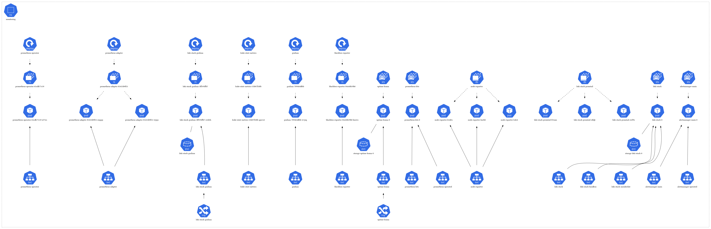

# Monitoring & Observability

## Loki Stack
**Purpose**: Log aggregation and visualization (Grafana + Loki)

The Loki Stack provides comprehensive logging and visualization capabilities for the cluster. It includes Grafana for dashboards and Loki for log aggregation, allowing you to monitor and troubleshoot applications effectively.

**Components**:
- **Grafana**: Dashboard and visualization platform
- **Loki**: Log aggregation system
- **Promtail**: Log collection agent

**Features**:
- Centralized log management
- Powerful querying capabilities
- Custom dashboards
- Alerting and notifications

## Uptime Kuma
**Purpose**: Uptime monitoring and status page

Uptime Kuma provides real-time monitoring of services and applications, with a beautiful status page that can be shared with users. It supports various monitoring protocols and provides detailed uptime statistics.

**Features**:
- Real-time monitoring
- Beautiful status page
- Multiple notification channels
- Detailed uptime statistics
- SSL certificate monitoring
- Docker support

 
### Storage: MariaDB, not SQLite on NFS

Uptime Kuma's database runs on a dedicated MariaDB StatefulSet
(`clusters/dev/apps/uptime-kuma/mariadb.yaml`) whose PVC uses the
**`microk8s-hostpath`** storage class. This is deliberate.

**Do not move a database onto the `nfs-client` storage class.** SQLite in WAL
mode coordinates writers through an mmap'd `-shm` file, and NFS cannot keep
that mapping coherent across clients. SQLite's own documentation says WAL does
not work on network filesystems.

This bit us: the original SQLite database sat on an NFSv3 PVC and corrupted on
2025-11-26, then threw `SQLITE_CORRUPT` for nine months (1638 errors) until it
was noticed, because the failure was silent from the UI until login broke.
`PRAGMA integrity_check` under-reported the damage — it only walks reachable
B-trees, and the `monitor` table's root page had been overwritten by
neighbouring `stat_minutely` pages, so the table was unreadable but not
"corrupt" by that check. All heartbeat and stats history was lost; the monitor
definitions were reconstructed from free-page remnants via `strings`.

The corrupt database is archived on the NFS volume at
`/app/data/corrupt-sqlite-2026-08-22/`.

### Pin the image, don't float the tag

The v1 -> v2 jump that triggered the corruption happened by accident: the
HelmRelease set `image.tag: "2-slim"`, a floating tag, so an ordinary pod
restart silently crossed a major version and enabled v2's aggregate tables.

The HelmRelease now sets **no** `image.tag`, letting the chart pin the app
version. Renovate then surfaces major upgrades as a reviewable PR instead of
landing them on the next restart. Apply the same rule to other apps.
