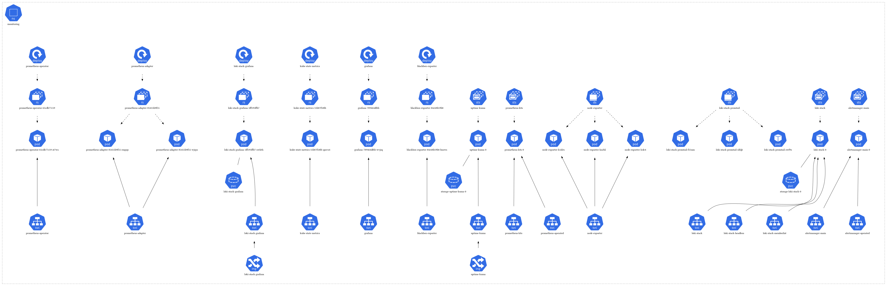

# Monitoring & Observability

## Logging
**Purpose**: Collect every pod's logs and make them searchable in Grafana.

Replaced the deprecated `loki-stack` chart (Loki 2.9, Promtail, Grafana
10.3) on 2026-10-03; see
[the design](../superpowers/specs/2026-10-03-loki-modernization-design.md).

| Component | Where | Notes |
|---|---|---|
| **Loki** 3.6 | `apps/loki/`, chart `grafana/loki` | Single binary, tsdb/v13 on a 10Gi NFS PVC. Service `http://loki.monitoring.svc.cluster.local:3100`. |
| **Alloy** | `apps/alloy/`, chart `grafana/alloy` | DaemonSet tailing `/var/log/pods` on each node. Same labels Promtail used: `namespace`, `app`, `instance`, `component`, `pod`, `container`, `node_name`, `job` (`<namespace>/<app>`). |
| **Grafana** 13 | `apps/prometheus/`, kube-prometheus-stack | `https://grafana.internal`. Prometheus and Loki datasources plus the stock Kubernetes dashboards and the Loki Overview dashboard (`apps/loki/grafana-dashboard-configmap.yaml`), all provisioned from git. |

**Retention**: 7 days by default; 14 days for `kube-system`, `monitoring` and
`teslamate`. Enforced by Loki's compactor.

**Grafana login**: user `admin`; the password is in SealedSecret
`grafana-admin`:

```bash
kubectl -n monitoring get secret grafana-admin -o jsonpath='{.data.admin-password}' | base64 -d
```

### Things that bit during the migration

- **Alloy drops lines older than 1h** (`stage.drop` in its config). Loki
  rejects entries more than 1h behind a stream's newest entry, and inside a
  multi-stream batch that rejection comes back as HTTP 500, which Alloy
  retries forever, stalling all collection. The cost: after more than 1h of
  Alloy downtime, the older part of the gap is not backfilled.
- **Alloy's read positions live on the node** (`/var/lib/alloy`), not the
  chart's default `/tmp`, so restarts resume instead of re-sending every file.
- **Loki query sharding is off.** With it on, metric queries such as
  `count_over_time` multiplied results by the shard count (285 reported vs 15
  real lines).
- **Grafana's sidecars set `DISABLE_X509_STRICT_VERIFICATION`.** The microk8s
  cluster CA has no Key Usage extension, which Python 3.13+ rejects under
  strict verification; the sidecars crash-looped and Grafana had no
  datasources or dashboards. The API server cert is still verified.
- **kube-prometheus-stack's etcd, scheduler, controller-manager and
  kube-proxy monitors are disabled.** microk8s runs them inside kubelite, so
  they never had targets.



## Uptime Kuma
**Purpose**: Uptime monitoring and status page

Uptime Kuma provides real-time monitoring of services and applications, with a beautiful status page that can be shared with users. It supports various monitoring protocols and provides detailed uptime statistics.

**Features**:
- Real-time monitoring
- Beautiful status page
- Multiple notification channels
- Detailed uptime statistics
- SSL certificate monitoring
- Docker support

 
### Storage: MariaDB on NFS, not SQLite on NFS

Uptime Kuma's database runs on a dedicated MariaDB StatefulSet
(`clusters/dev/apps/uptime-kuma/mariadb.yaml`) on the `nfs-client` storage
class, so it sits inside the NAS backup scope like everything else.

**The distinction that matters is SQLite vs. a database server, not NFS vs.
local disk.** SQLite in WAL mode coordinates multiple *client* processes
through an mmap'd `-shm` file, and NFS cannot keep that mapping coherent —
SQLite's own documentation says WAL does not work on network filesystems.
A MariaDB or Postgres server process owns its data directory exclusively and
serves clients over TCP, so no cross-client mmap is involved. That is why the
`coder` CNPG cluster and the teslamate Postgres have run happily on
`nfs-client` for years while the SQLite file did not.

The one rule for a database server on NFS: never let two server processes open
the same datadir, or InnoDB will corrupt. A StatefulSet guarantees at most one
pod per ordinal — do not force-delete the pod while it may still be running on
an unreachable node.

This bit us: the original SQLite database sat on an NFSv3 PVC and corrupted on
2025-11-26, then threw `SQLITE_CORRUPT` for nine months (1638 errors) until it
was noticed, because the failure was silent from the UI until login broke.
`PRAGMA integrity_check` under-reported the damage — it only walks reachable
B-trees, and the `monitor` table's root page had been overwritten by
neighbouring `stat_minutely` pages, so the table was unreadable but not
"corrupt" by that check. All heartbeat and stats history was lost; the monitor
definitions were reconstructed from free-page remnants via `strings`.

The corrupt database is archived on the NFS volume at
`/app/data/corrupt-sqlite-2026-08-22/`.

**Uptime Kuma cannot use the CloudNativePG operator.** Version 2.5.0 supports
only `sqlite` and `mariadb` (see `/app/server/database.js`); there is no
Postgres driver. This is an application limit, unrelated to storage.

### Pin the image, don't float the tag

The v1 -> v2 jump that triggered the corruption happened by accident: the
HelmRelease set `image.tag: "2-slim"`, a floating tag, so an ordinary pod
restart silently crossed a major version and enabled v2's aggregate tables.

The HelmRelease now sets **no** `image.tag`, letting the chart pin the app
version. Renovate then surfaces major upgrades as a reviewable PR instead of
landing them on the next restart. Apply the same rule to other apps.

### TeslaMate data freshness check

Two separate monitors cover TeslaMate's database, deliberately kept apart so
the alerts mean different things:

| Monitor | Type | Checks |
|---|---|---|
| `Teslamate` | http, 60s | The web UI is up (process liveness) |
| `Postgres - Teslamate` | postgres, 60s | Postgres is reachable and accepting auth (`SELECT 1`) |
| `Teslamate - Data Freshness` | postgres, 300s | Data is flowing while a car is online |
| `Teslamate - Tesla API Reachable` | keyword, 1800s | TeslaMate can still reach Tesla's API — see [notes](./monitor-queries/teslamate-tesla-api-reachable.md) |

Note the database alone **cannot** distinguish "car is asleep" from "pulls are
failing" — both produce zero writes. That gap is why the Loki-backed token
refresh monitor exists; see its notes for the coverage matrix and the one
failure mode nothing can catch.

The freshness query lives in
[`monitor-queries/teslamate-data-freshness.sql`](./monitor-queries/teslamate-data-freshness.sql),
kept in git because monitor configuration otherwise exists only inside the
Uptime Kuma database.

Two things about it are non-obvious:

**Uptime Kuma's postgres monitor ignores the result set.** It only fails if the
query throws (`server/monitor-types/postgres.js` awaits the query and then
unconditionally sets status UP). So the check is a `DO $$ ... RAISE EXCEPTION`
block; the exception text becomes the heartbeat message and the Slack alert.

**A plain "is the newest row recent?" check would false-alarm nightly.**
TeslaMate writes nothing while a car is asleep or offline — during one sample
both cars had been quiet for ~8 hours, entirely normally. The query therefore
only alerts when a car's open `states` row says `online` (data *is* expected)
but its newest position is older than 15 minutes. Position cadence while online
is 1-6 seconds, so that threshold is a wide margin.
