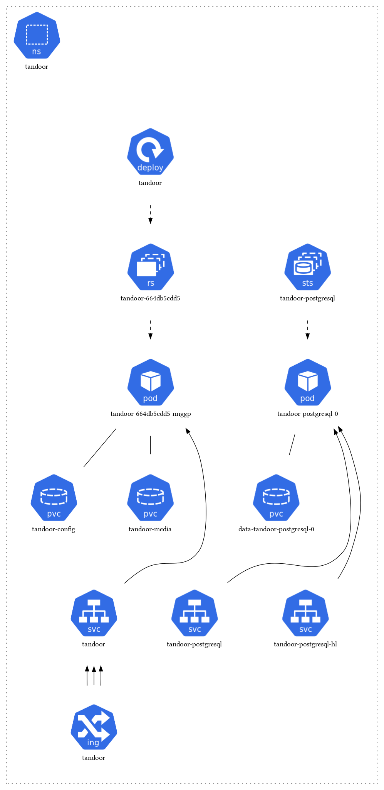

# Tandoor Recipes

**Purpose**: Recipe management and meal planning

Tandoor Recipes is a comprehensive recipe management and meal planning application. It helps you organize recipes, plan meals, create shopping lists, and manage your cooking workflow.

## Features

- **Recipe management**: Store and organize recipes with ingredients and instructions
- **Meal planning**: Plan meals for the week with drag-and-drop interface
- **Shopping lists**: Automatically generate shopping lists from meal plans
- **Nutritional information**: Track nutritional content of recipes
- **Recipe scaling**: Easily scale recipes up or down
- **Import/Export**: Import recipes from various sources and export in multiple formats
- **Mobile-friendly**: Responsive design works on all devices

## Architecture

Tandoor Recipes runs with a PostgreSQL database and includes static file serving:

## Components

- **Tandoor Recipes**: Main application for recipe management
- **PostgreSQL**: Database for storing recipes and user data
- **Nginx**: Static file serving and reverse proxy
- **Redis**: Caching and session management (optional) 