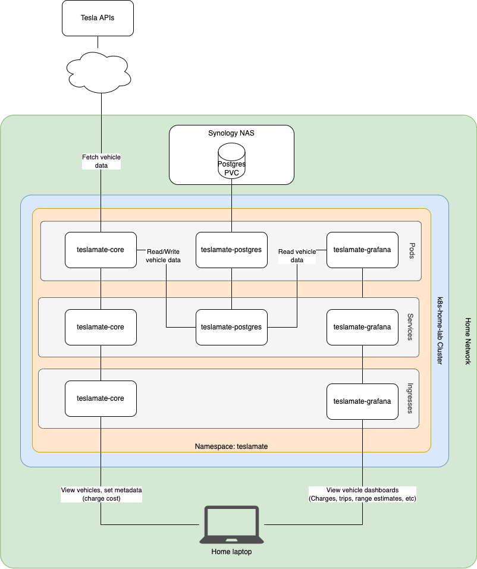

# TeslaMate

**Purpose**: Tesla vehicle data logging and visualization

TeslaMate is a comprehensive Tesla vehicle data logging and visualization platform. It collects data from Tesla's APIs and provides detailed insights into vehicle usage, efficiency, and performance.

## Features

- **Real-time data collection**: Continuously monitors vehicle status and location
- **Efficiency tracking**: Detailed analysis of energy consumption and efficiency
- **Trip logging**: Automatic recording of all trips with detailed statistics
- **Charging analysis**: Monitor charging sessions and costs
- **Geofencing**: Automatic location-based actions and notifications
- **Grafana dashboards**: Beautiful visualizations of all collected data

## Architecture

TeslaMate includes a complete monitoring stack with PostgreSQL database and Grafana for visualization:

## Deployment Overview

The TeslaMate deployment includes a complete monitoring stack:

## Components

- **TeslaMate**: Main application for data collection and web interface
- **PostgreSQL**: Database for storing vehicle data
- **Grafana**: Visualization and dashboard platform
- **Nginx**: Reverse proxy and SSL termination 