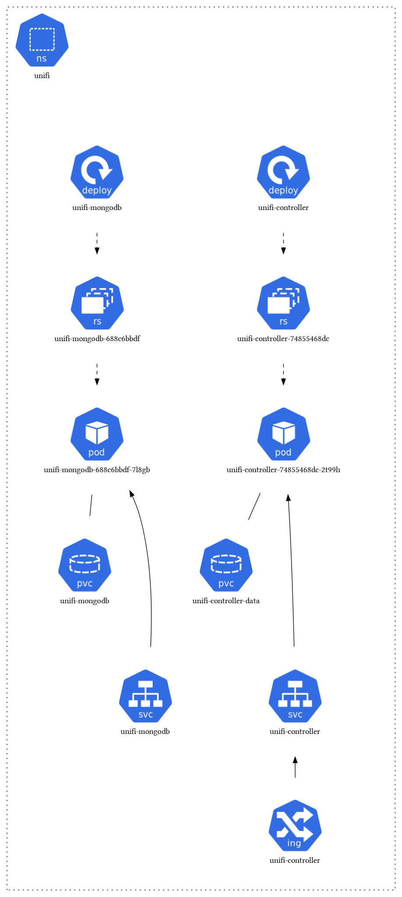

# UniFi Controller

**Purpose**: Network management for Ubiquiti devices

The UniFi Controller is a powerful network management application for Ubiquiti networking equipment. It provides centralized management of UniFi access points, switches, and security gateways.

## Features

- **Centralized management**: Manage all UniFi devices from a single interface
- **Network monitoring**: Real-time monitoring of network performance and devices
- **Guest portal**: Customizable guest network access
- **Traffic analysis**: Detailed network traffic statistics and analytics
- **Device provisioning**: Automatic device discovery and configuration
- **Firmware management**: Centralized firmware updates for all devices
- **Site management**: Multi-site support for complex deployments

## Architecture

The UniFi Controller runs with MongoDB for data storage and includes comprehensive network management capabilities:

## Components

- **UniFi Controller**: Main network management application
- **MongoDB**: Database for storing network configuration and statistics
- **PersistentVolume**: Storage for application data and backups
- **Traefik Ingress**: External access and SSL termination

## Network Integration

The UniFi Controller integrates with your existing network infrastructure to provide comprehensive management of Ubiquiti devices, including access points, switches, and security appliances. 