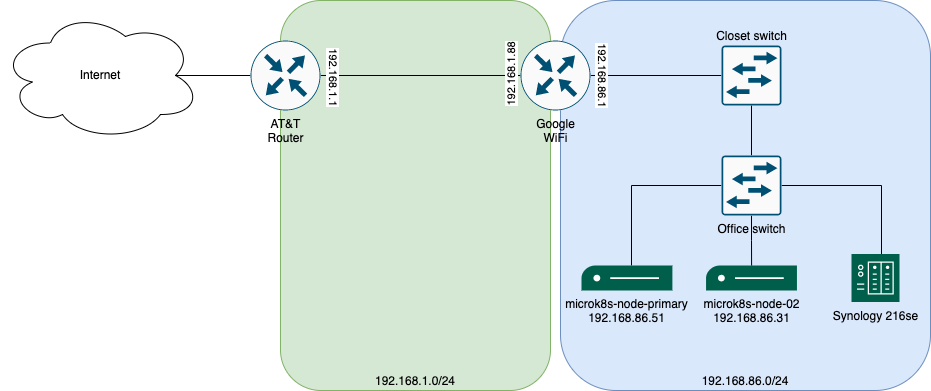

# Topology

I am starting off pretty basic, so nothing super thrilling about the topology currently, but here is what it looks like.

## Network

Note: There are Calico VLANs managed by MicroK8s that aren't (yet) represented on this diagram.

## Hardware

 